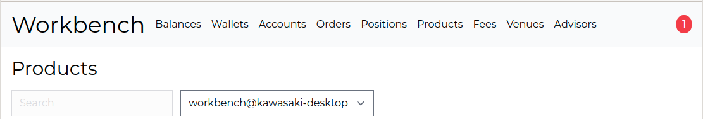
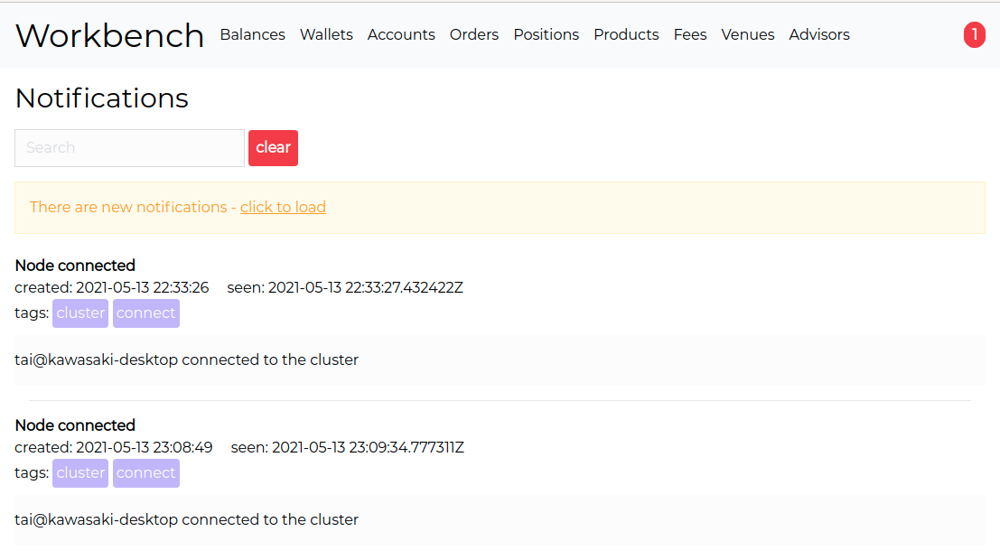

# NotifiedPhoenix
[](https://github.com/fremantle-industries/notified_phoenix/actions?query=workflow%3Atest)
[](https://hex.pm/packages/notified_phoenix)

Phoenix live views for [notified](https://github.com/fremantle-industries/notified)

## Installation

Add the `notified_phoenix` package to your list of dependencies in `mix.exs`:

```elixir
def deps do
  [
    {:notified_phoenix, "~> 0.0.1"}
  ]
end
```

## Usage

### Live Badge

```elixir
<%= live_render(@socket, NotifiedPhoenix.BadgeLive, [] %>
```



### Live List

```elixir
<%= live_render(@socket, NotifiedPhoenix.ListLive, class: "my-custom-style" %>
```



## Authors

- Alex Kwiatkowski - alex+git@fremantle.io

## License

`notified_phoenix` is released under the [MIT license](./LICENSE)
