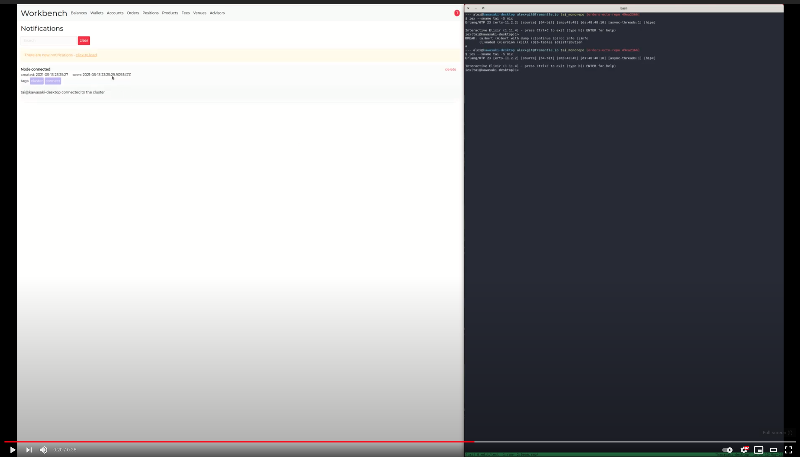

# NotifiedPhoenix
[](https://github.com/fremantle-industries/notified_phoenix/actions?query=workflow%3Atest)
[](https://hex.pm/packages/notified_phoenix)

Phoenix live views for [notified](https://github.com/fremantle-industries/notified)

[](https://youtu.be/NJS0YTsKoiQ)

## Installation

Add the `notified_phoenix` package to your list of dependencies in `mix.exs`:

```elixir
def deps do
  [
    {:notified_phoenix, "~> 0.0.4"}
  ]
end
```

## Usage

### Live Badge

```elixir
<%= live_render(@socket, NotifiedPhoenix.BadgeLive, [] %>
```


### Live List

```elixir
<%= live_render(@socket, NotifiedPhoenix.ListLive, class: "my-custom-style" %>
```


## Receivers

`NotifiedPhoenix` ships with extra receivers that can be used within modern web browsers

- `NotifiedPhoenix.Receivers.Speech` - Uses the experimental [SpeechSynthesis](https://developer.mozilla.org/en-US/docs/Web/API/SpeechSynthesis) API to read the subject of the notification
- `NotifiedPhoenix.Receivers.BrowserNotification` - Uses the browsers native [Notification](https://developer.mozilla.org/en-US/docs/Web/API/notification) API to display a notification on the host system

```elixir
config :notified, receivers: [
  {NotifiedPhoenix.Receivers.Speech, []}
  {NotifiedPhoenix.Receivers.BrowserNotification, []}
]
```

## Authors

- Alex Kwiatkowski - alex+git@fremantle.io

## License

`notified_phoenix` is released under the [MIT license](./LICENSE)
